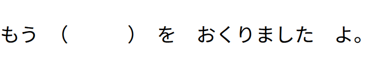
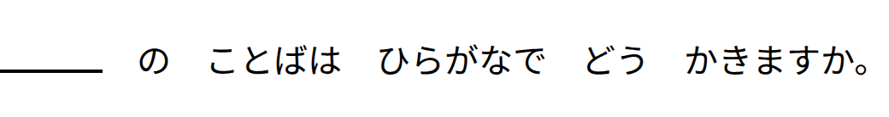
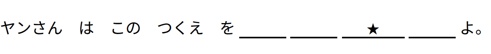
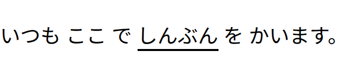
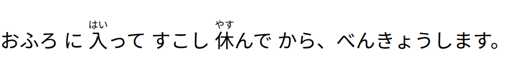

# Marcadores de Formatação de questões

Este documento define os marcadores de texto usados no banco de dados para representar questões em japonês de forma consistente no app.

---

## Índice

- [Marcadores de Formatação de questões](#marcadores-de-formatação-de-questões)
  - [Índice](#índice)
  - [1. `[blank]` - Lacuna simples](#1-blank---lacuna-simples)
    - [String (JSON)](#string-json)
    - [Renderização no App](#renderização-no-app)
  - [2. `[underline_blank]` - Lacuna com sublinhado](#2-underline_blank---lacuna-com-sublinhado)
    - [String (JSON)](#string-json-1)
    - [Renderização no App](#renderização-no-app-1)
  - [3. `[star_underline_blank]` - Lacuna com estrela central](#3-star_underline_blank---lacuna-com-estrela-central)
    - [String (JSON)](#string-json-2)
    - [Renderização no App](#renderização-no-app-2)
  - [4. `{texto}` - Palavra sublinhada](#4-texto---palavra-sublinhada)
    - [String (JSON)](#string-json-3)
    - [Renderização no App](#renderização-no-app-3)
  - [5. Furigana `漢字[かんじ]`— Kanji com Hiragana em cima](#5-furigana-漢字かんじ-kanji-com-hiragana-em-cima)
    - [String (JSON)](#string-json-4)
    - [Renderização no App](#renderização-no-app-4)

---

## 1. `[blank]` - Lacuna simples

### String (JSON)

```text
もう　（[blank]）　を　おくりました　よ。
```

### Renderização no App



---

## 2. `[underline_blank]` - Lacuna com sublinhado

### String (JSON)

```text
[underline_blank]　の　ことばは　ひらがなで　どう　かきますか。
```

### Renderização no App



---

## 3. `[star_underline_blank]` - Lacuna com estrela central

### String (JSON)

```text
ヤンさん　は　この　つくえ　を[underline_blank][underline_blank][star_underline_blank][underline_blank]よ。
```

### Renderização no App



---

## 4. `{texto}` - Palavra sublinhada

### String (JSON)

```text
いつも　ここ　で　{しんぶん}　を　かいます。
```

### Renderização no App



---

<a id="furigana"></a>

## 5. Furigana `漢字[かんじ]`— Kanji com Hiragana em cima

### String (JSON)

```text
おふろ　に　入[はい]って　すこし　休[やす]んで　から、べんきょうします。
```

### Renderização no App



---
